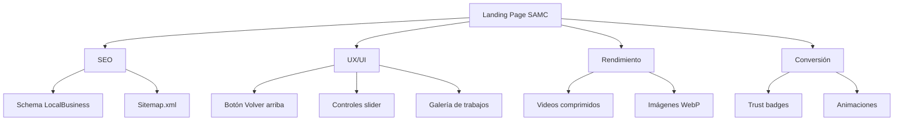

# Análisis y Mejoras del Landing Page - SAMC Barbers

## ✅ Lo que está bien:
- Estructura semántica correcta (header, nav, sections, footer)
- SEO básico implementado (meta tags, JSON-LD, Open Graph)
- Diseño responsive con max-width: 920px
- Internacionalización (i18n) ya implementada
- WhatsApp floating button
- Videos con lazy loading

---

## 🚀 Mejoras Sugeridas:

### 1. SEO (Prioridad Alta)
- [ ] Schema.org LocalBusiness completo - agregar más propiedades
- [ ] Canonical URL relativa
- [ ] El sitemap.xml está prácticamente vacío

### 2. UX/UI (Prioridad Media)
- [ ] Agregar botón "Volver arriba" (scroll to top)
- [ ] Slider de videos sin controles de navegación
- [ ] No hay galería de fotos de trabajos realizados

### 3. Rendimiento (Prioridad Media)
- [ ] Comprimir videos (actualmente ~7MB total)
- [ ] Convertir imágenes a WebP (SAMC1.png = 1.4MB)
- [ ] Agregar prefetch de recursos

### 4. Conversión (Prioridad Baja)
- [ ] Agregar trust badges
- [ ] Animaciones scroll reveal
- [ ] Información más completa en footer

---

## 📊 Resumen Visual:

---

## 📝 Mejoras por Prioridad:

| Prioridad | Mejora | Impacto |
|-----------|--------|---------|
| 🔴 Alta | Schema.org LocalBusiness completo | SEO |
| 🔴 Alta | Agregar botón "Volver arriba" | UX |
| 🟡 Media | Comprimir videos | Rendimiento |
| 🟡 Media | Galería de trabajos | Social Proof |
| 🟢 Baja | Trust badges | Conversión |
| 🟢 Baja | Animaciones scroll reveal | UX |
